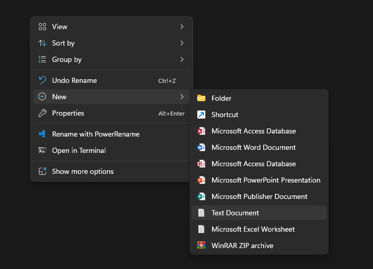
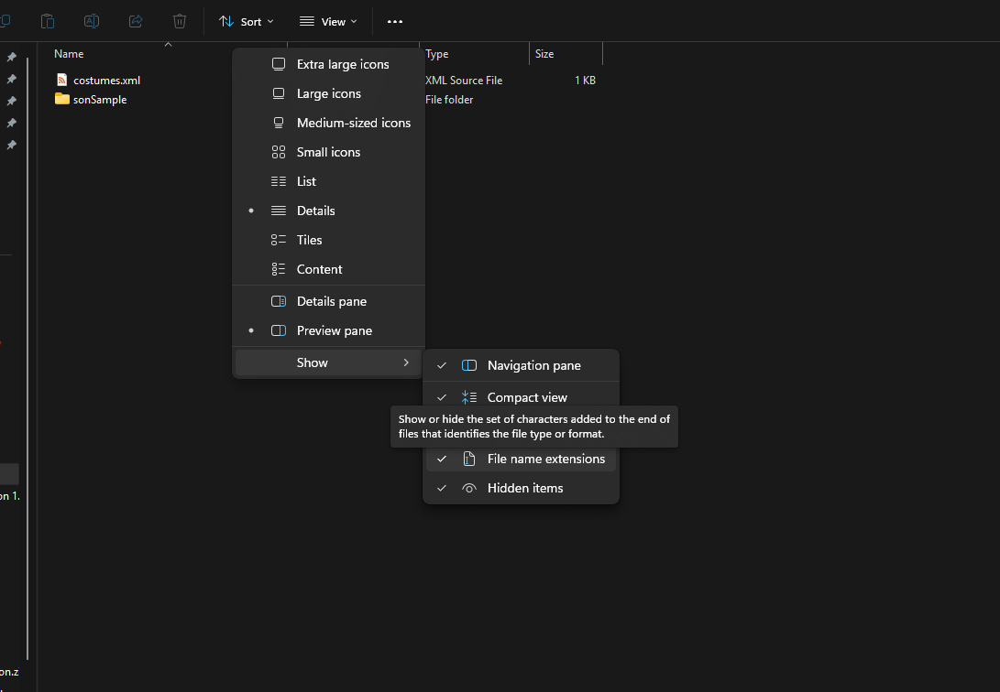
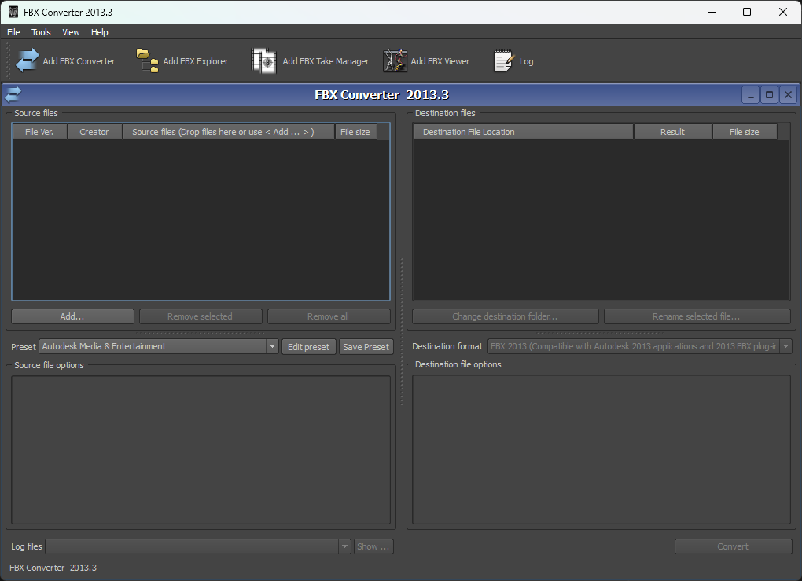
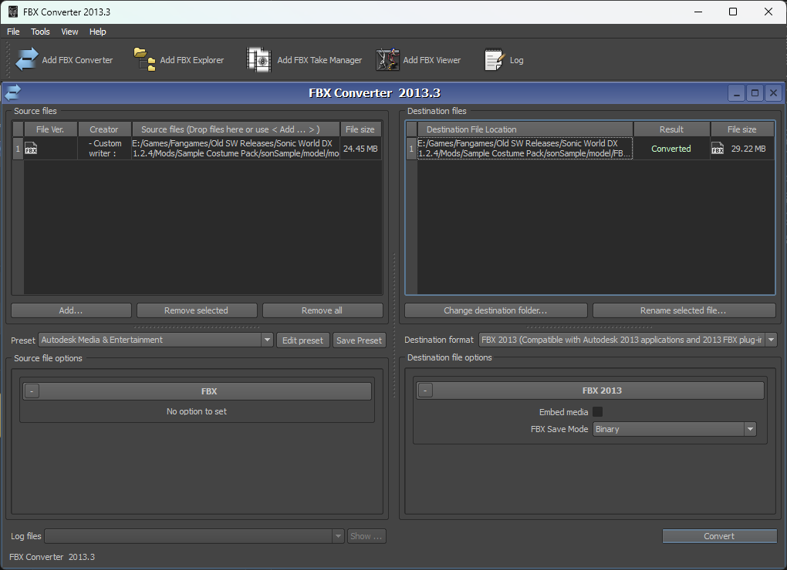
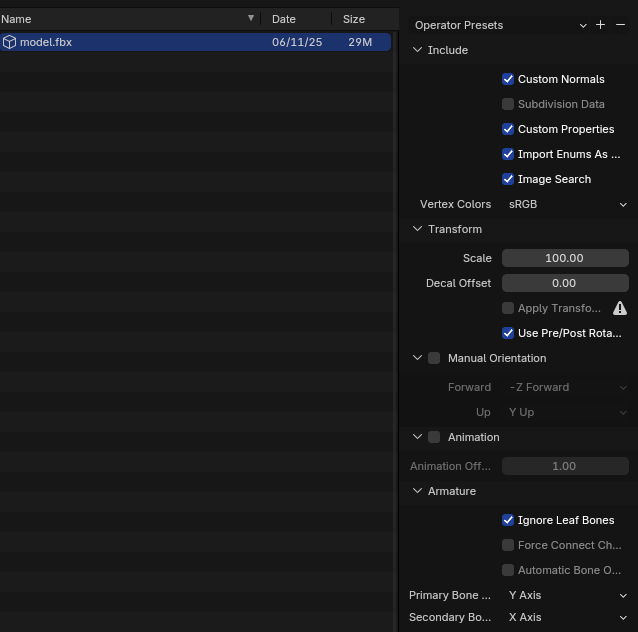

# Creating Costume mods

### 0.1: Software Required

[FragMOTION 1.2.6](https://gamebanana.com/tools/6575){ .md-button .md-button--primary }

- FragMOTION is known as "nagware", where when used freely, it will have an obnoxious popup unless you type a prayer into your textbox.
- The purchasing page no longer works for FragMOTION, meaning you cannot currently buy it, or get rid of this nag without an existing key. Go into the program for the first time, navigate to `Help/Register FragMOTION` on the toolbar on the top of the winder and insert these:

- Product Code: `9B0BC130010E4C00CE0088CA0C4C14AB`
- Registration Code: `A6F82D4423AF34AC59FA5D6291F4BE7A`

**Latest** version of Sonic World DX (V1.2.7)

 - Versions prior to 1.2 do not support custom costumes, and several bugs relating to them were fixed between patches

### 0.2: Modelling Software

[:material-blender-software: Blender](https://www.blender.org/ "A better animation suite, doesn't support .B3D"){ .md-button .md-button--secondary }

There's no specific modelling software for this required aside from FragMOTION. For the purposes of this tutorial we will use Blender with two different setups:

[1. No addons, Requires Autodesk FBX Converter (Free)](https://gamebanana.com/tools/16462 "To convert Blender's FBX to FBX 2009"){ .md-button .md-button--secondary }

[2. Better FBX Importer & Exporter (Paid Addon)](https://blendermarket.com/products/better-fbx-importer--exporter "To convert Blender's FBX to FBX 2009"){ .md-button .md-button--secondary }

This is because FragMOTION only reads FBX files versioned 2010 or earlier, which modern versions of Blender *cannot read or write to*. While some newer versions of Blender can import these, they cannot export them, so the FBX Converter is still required for that.

The BetterFBX addon supports importing and exporting to many different FBX versions, allowing it to import and export to FragMOTION.

When the steps differ, follow the tab labelled "Converter" if using Autodesk FBX Converter, and "BetterFBX" if using the Better FBX addon

### 1 Folder Structure

Create a folder in your mods folder, named whatever. This will be where your costumes will be stored. Costume mods are read in a way to allow them, to be released in packs.

In this empty folder, you will need to add 2 things:

#### 1.1 The XML
- Enter your created folder, right click to bring up the context menu and create a new Text Document.



-  Name it `costumes.xml`. Make sure the .txt is changed to .xml or else it will not be read by the game.
  - If you cannot see .txt at the end, you have file extensions hidden. Enable them by going to View/Show File name extensions



- Open the costumes.xml in a text editor anc paste the following in.

```xml title="costumes.xml" linenums="1"
--8<-- "costumes.xml"
```

- `is`: the three letter code of the character the mod is for.
- `name`: The name for the costume
- `desc`: The description displayed on the character select.

#### 1.2 The Model
- Create a new folder, named a combination of the `is` and `name` in the xml. In this case it'd be `sonSample`
- Go into your newly created folder.
- Make a new folder in that folder, named `model`. This will be where your model and textures will be exported to!

### 2 Exporting into Blender

To make a costume, you need the base model of the character to modify!

#### 2.1 Exporting from FragMOTION

- Open FragMOTION. Ignore and skip any nags it gives.
- If you have not already registered FragMOTION:

  - Go to Help/Register FragMOTION.
  - Fill in the following fields:

    - Product Code: `9B0BC130010E4C00CE0088CA0C4C14AB`
    - Registration Code: `A6F82D4423AF34AC59FA5D6291F4BE7A`
  - Click register.

  FragMOTION is now registered and will no longer nag. Now you can work within the app without interruption.

  - On the top left of the program, select File/Import.
  - Go to your DX folder and navigate to `Data/Characters/[char]/model/` and import `model.b3d`
    - replace `[char]` with the three letter code you also used in `is`.
  - Once the model shows in FragMOTION, Go to File/Export.
  - Change the Save As Type to Alias FBX.
  - Save the fbx file to the same model folder you created for the mod earlier. **NOT the path in the Data folder.**
  - In FragMOTION's texture tab, take note of all textures the existing model uses. Copy and paste them into your mod's model folder.

Now that the FBX is created, you'll need to open the FBX.

#### 2.2 Importing into Blender

- Open Blender.

=== "Converter"
  - Download the converter to a folder you will remember it. It doesn't have to be in the game folder.
  - Open the converter.
  
  - Drag the model.fbx you exported into the source files.
  - Keep the Destination format as `FBX 2013`. This will be changed when you import it back later.
  - Click convert. This will convert the FBX in a new folder inside model called `FBX 2013`
  
  - In blender, Import as FBX, Using these settings:
  
=== "Addon"
  - Try this heheh aha
