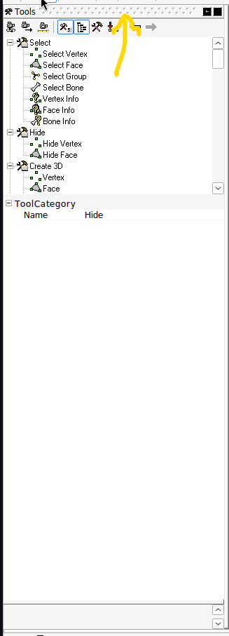
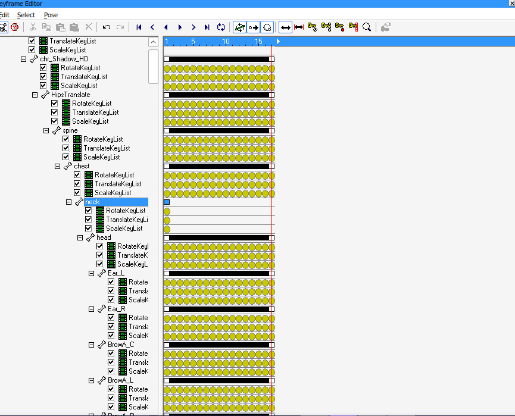

# Animating in Fragmotion
 

## 0: Intro

With a little bit of reading, you can start animating in 20 minutes, or less! Let's begin by opening Fragmotion!

- Depending on your screen size, and customizations some interface options may look different.
- To anyone using a screen reader, I tried my best. Hopefully the information comes out properly.

NOTE: This guide uses game files to teach the sheer basics of animation in Fragmotion, be sure to make a backup of any file you modify, or you will need to redownload the game. The animation process is the same when making actual mods. This guide does NOT teach you how to create a proper mod, please reference (Insert mod XML guide here). Enjoy!

- To backup a character please right-click the file you will be modifying, and make a copy. You will right click a blank area within your folder to paste, when asked whether to overwrite, or rename the file select "Rename". You now have a backup of the file we will be modifying.

### 0.1: Software Required

[Fragmotion 1.2.6](https://gamebanana.com/tools/6575)

- Fragmotion initially asks you to Pray to our lord, and saviour Shadow the Hedgehog. Please feel free to skip this, when the program opens up move your mouse to the top-left of your window where it says "File", please navigate all the way to "Help" then select, "Register Fragmotion". Fragmotion is an abandoned product that no longer allows you to Purchase a key.

- Product Code: 9B0BC130010E4C00CE0088CA0C4C14AB
- Registration Code: A6F82D4423AF34AC59FA5D6291F4BE7A

### 0.2: Optional Software

[Blender](https://www.blender.org/)

[FBX Converter](https://gamebanana.com/tools/16462) - Free

[Better FBX Importer & Exporter](https://blendermarket.com/products/better-fbx-importer--exporter) - 28 USD

[Positioning Assistance Tool](https://gamebanana.com/tools/10426)

[Height Chart](https://gamebanana.com/tools/11329)

- Blender is an alternative to Fragmotion for animating, but requires you to export the file as FBX 2009 so it can be imported to Fragmotion, then re-exported as B3D a file that is compatible with SWDX. 

- FBX Converter can convert the files for free, but doesn't always work.

- Better FBX Importer & Exporter converts the files directly in Blender on export, and has shown to be far more convenient then the free Alternative. 

For the purposes of this tutorial we will be Animating in Fragmotion, so none of this is needed unless you plan on using your own models.

## 1: Camera, Common Interface Options

In the middle of the screen you will see a Grid, let's call this a "Field". It's where we will see your character on screen!
Pressing right click allows you to rotate the camera, if you right click in middle it'll rotate kind of how you expect it to. 
If you right click the outside however it will rotate in a different way, kind of like a plane rotates.
If you middle click the screen you are able to move around when dragging your mouse.

- Right click to Rotate
- Middle Click to Move
- You can mouse over any selectable object within fragmotion, and a popup will appear that shows you the name of an interface option

### 1.1: Camera Angles

See those yellow people at the top?
Selecting 3D let's you view a character as if it were in the game.
The other yellow "people" are for different views feel free to click on them, and see what they do.

- Yellow People control Camera Angles
- 3D is similar to the in game Camera
- Left, Right, Top, Bottom, Forward, and Backward are for Bio, and Victory Animations

### 1.2: Vertices, and Bones

Say you accidentally bring up a bunch of yellow dots, these are called "Vertices". You can enable, or disable them via the Green dots at the top of your interface.

![At the top left of your screen, follow the text prompts all the way to Help, below Help you will see a blue cube, beside that to the right are five symbols that represent ways to view what are called Vertice, the triangles, that make up your character. The red Circle is a Wireframe, the two triangles are Backfaces, things you normally do not see on a character, the bones do as shown, show bones with line, and dots, the GREEN dots show your vertices which will be the yellow dots on screen, the skull plus crossbones is for your blue colored bones, the three colorful lines are for XYZ axis, and finally the last one is for your grid. These are all modified by left clicking. ](img/A12.png)

- The Green dots are Vertices
- Vertices represent the triangles that make up your character
- You can turn them off with the FOUR green dots at the top

If you have blue dots, you can disable them via the Skull next to the green dots. These are your characters "Skeleton".

Now that you know these common buttons, let's open a character!

## 2: Setting up a Character Model

If you want to edit a character, File > Open > Sonic World DX > Data > Characters > 3 letter name > Model > model.b3d.

  
  

So here we've opened Shadow the Hedgehog.
The character will be blacked out if using a model from SWDX.

- B3D Files are a "lossy" format used by Blitz3D, i.e SWDX.
- You can also open FBX 2009, OBJ, DAE, and UGH files among many others
- When modifying your character alway save as .UGH, save as .B3D when you're done
- All characters are blacked out because of "Reference Maps" which create layers on a character that show up Black in fragmotion
- MODEL.b3d = In game Model
- BIO.b3d = Character Select Model

### 2.1: Let there be color!

On the right, there's a section called "Model". Click on that.
You'll see the Model,Smoothing Groups, Textures, and Materials menu.

You can expand Materials with the little plus button to the left, and a material object the same way.
Click on a grey box.

Example of Materials

Under properties you will see "Texture Layer" and "Type". Select Bumpmap under the type. Your material will change from a LIGHT grey box to a 3D grey box. You should see some color on the model now!

- If you are colorblind, or lack depth perception you will make sure the little bubbles are filled next to "BumpMap" in this part of the tutorial

Now that we can see our character, let's set up our Interface, and Tools!

## 3: Interface

Let's go to the "Tools" menu, and select "Show Tree"

For now you can select "Hide" since we aren't using the Tools

While were here you can grab the "PADDED" bar that's grey, and drag the tool menu to the far left of your screen to expand your view of it, and make the workspace easier to use. You are able to drag any workspace to any location on your screen, but for the purposes of this tutorial I use the left side for "TOOLS"

Feel free to customize it to your liking.

- We setup our Tool Tree
- Selected Hide so we don't activate anything
- Changed our UI to better fit our needs

### 3.1: Basic Animating interface

Let's move on to something, more interesting.
You can click on the Animations tab to view animations.

There is a media player on the bottom of the screen.
It will play the animation forward, backward, or frame by frame
a frame being a single image.

Example here, of Frame 8 , or Image 8 of Shadow walking.

This bar will show you the MAX number of frames in this "Animation", which is essentially just a video, in the RED box.
The GREEN box is where the animation starts, and the WHITE is your current frame, or image
Let's look at the blue lines again, it might hurt your eyes, or look hideous, but they are important to the way Animating works within SWDX.

So at the top "Show Skeleton"

Then double click your first animation, the "IDLE".
This weird menu with a lot of scary dots will show up.
These are called keyframes, and they aren't really important to us yet, but will be later.
On the left of this scary box you can see Skeleton's bones spread out in a "Tree".

![The keyframe Editor shows your characters Bones in a tree format in the far left menu where you will see "Skeleton", reference, chr_Shadow_HD, etc. You will also see Edit, Select, Pose. These are used in advanced techniques. Below that are the Skeletal Animation, and Vertex Animation. SWDX uses Skeletal animation so please ignore Vertex Animation. Following along the bar are the Cut, Copy, Paste, Paste Blended, and Delete buttons. These only activate if you left-click a yellow bubble. Next is Undo, and Redo. Then you have the animation player buttons again. We'll go over the rest of the interface further along in the tutorial.](img/A24.png)

If you click on any of the parts of the skeleton, say the neck, you'll see a red dot, which is the bone they define as "NECK" in your "FIELD", it has some green tree branches. Everything above shadows neck should be selected.
These are all of the bones attached to the Neck.
So when Shadows Neck moves, these bones move with it.
You can see that when you play the animation.

- You have a Media player that can control the "Animation"
- WHITE box shows the CURRENT image
- GREEN box shows the FIRST image
- RED box shows the LAST image
- "Animations" are really just "images" that you put together to make a "Video"
- These "Videos" play in the game under certain names like "IDLE"
- You can open a box that shows you your "images" by double-clicking an "Animation", The Keyframe Editor
- The Keyframe Editor shows you a list of your bones that you can select
- Selected bones show up in the "Field" as RED dots, connected bones show up as GREEN dots

### 3.2: Skeletal Animation Widget

Let's go back to Tools. If you scroll down you'll see "Skeletal Animation".
This is how we are going to modify our animations, or even create new ones
You will click on the "Skeletal Anim Widget".

This circle will show up, you can drag it by left clicking the transparent area.
So you're able to move it out of the work space as I have here.
You have 6 tools on this "Widget", the "Bone Select" tool, which allows you to select a blue circle, or "Bone". 

The "Translate" tool, which allows you to move a bone in any direction.
You just select translate, and it's as simple as holding left click, and dragging!

Then you have the "Rotate" tool, which as it suggests allows you to rotate a bone

We skip the Rotate key local tool, it isn't important for what we're learning currently.
The "scale key" tool allows you to change the size of an object!
Currently our directions are unlocked so when testing this out you may be confused as to why it's so wonky.
We also skip inverse kinematics, I ACTUALLY have no clue what that does, feel free to mess with it though.

See these colors, they represent your X, Y, Z which are your Cardinal Directions.

Select the _L tool at the top of your screen, and colorful lines will show up representing X, Y, Z.
We call these "Axis".

Mousing over the colors on your triangle you can see we have of course X Y Z, and it says "restrict" which means movement of said object will only occur on those "Axis"
The yellow represents "Free" movement in any direction then the other colors are essential diagnal movement.

When animating in SWDX we usually use Red, Blue, and Green. Yellow itself isn't very accurate.
NOW everytime you swap tools it will remember the LAST used color you've chosen
for that tool. I've locked translate(movement) ,now I'm going to move shadows nose on the red axis as an example then swap to rotate.

You can see that when swapping to Rotate, it reverts to Yellow, free movement.
Your previous tools XYZ restriction does not transfer to a new tool.
However when swapping back your tools will remember their last used restriction.

### 3.3: Tool Properties

Okay now that we've covered the Widget, and it's many useful toolbelt like applications, let's look at our Tool properties!

I currently have the "Translation" tool selected.
Here you see "Keyframe Translation Tool".
Yours may look slightly different then mine due to some bugs with my version.
You can ignore your XYZ coordinate, these are used in more advanced placement options for the character. Feel free to mess around if you would like.

Applyto allows you to select where an "Image" or "Frame" edit you make goes
You can open it's dropdown menu. Current frame is the image you are on now, frames before is everything before your image, after is everything after it's a bit self explanatory. Loop will be whatever the green, and red box say at the bottom on the player. Then All frames is every image, this is useful for when you want a characters eyes to always be open, you just make the edit on "All frames".

The last real property that matters is AffectChildren, and a property called Uniform which isn't shown here.

Affect Children will allow the red bone you have selected to move other bones that are connected via the Green tree branches we saw before. This is useful to have on so you don't have to rotate every single bone, it does have instances where turning it off can be useful however, for instance moving a kneecap by itself.

Uniform keeps everything at the same scale when stretching pieces out. That way stuff doesn't look wonky.

- Skeletal Animation Tool is our main Animation Tool
- Translate Moves an Object, Rotate rotates an object, and Scale can make it bigger, or smaller.
- RED represents Y, BLUE represents X, and GREEN represents Z, you can lock tools to "Axis"
- Tools remember their locks
- Applyto property allows you to select which frame your modifications affect
- Uniform property changes whether your scale is Uniform, or not
- AfffectChildren property changes whether the GREEN bones move with a RED bone, or not.

## 4: Keyframe Editor

So you've been messing around while reading this, how do we retain the actions, or animations you've been making?

For this we go back to the "Keyframe Editor" by double clicking your animation.

You'll see a Red Line, it's currently on "Image" 1 for me or column 1
On the left you'll see these green boxes that represent rotation, translation, and scale which we messed around with earlier. Anything I do to this "Image" will create a new yellow bubble on column 1 beside rotation, translation, or scale besides whatever bone I have selected.

I've used right-click + Hold, and Drag to make a box around ALL of these bubbles, then I'm going to delete them using my DEL key on the keyboard. Any bubble that is BLUE is selected. Now I'm going to press play, and my neck no longer moves between "Images"!

Image two the head no longer flips back, but his nose does plop back down.

Let's make shadows head fully rotate for some nightmare fuel!

I'm going to move to the last frame with my red line, by left clicking on the number bar at the top of the screen, you can also move frames with the arrows at the bottom of the play bar, or by dragging the little bar on the timeline.

Let's finally learn more about the Keyframe Editor.
We call the Yellow Bubbles, Keyframes.
Now let's look towards the top of the Keyframe Window.

You'll see some Keys,the first 2 keys let you set your model to their default values, i.e tposing. The last 2 let you create either a single bubble, or a line of bubbles
via left clicking empty space.

There are also two double arrows, the one without red lines let you slide individual bubbles.
The one with red lines, moves all of your bubbles.

### 4.1: Finally Animating

So here I've created some bubbles on the final frame using the red dot Key.
I'm going to click the double arrow WITHOUT the red sides. We're swapping over to this mode so we don't keep making bubbles. 

Now we move to frame nine of our idle.

Here you can see I have moved shadows head on this "Image", or "Frame", a bubble has shown up under the ninth frame of the keyframe editor in the rotation section.

You'll notice that the image is moving by itself without you actually creating any new keyframes as we move along the frames,this is called interpolation. The program determines the path of the characters where all these bubbles are empty. It essentially fills in the blanks for you!

This doesn't quite get the head to rotate, but it does show how keyframes work. These are the basic essentials needed to animate in fragmotion, for a full rotation we're going to move to the middle of frame nine, and seventeen. I've gone ahead and rotated Shadows head creating a new keyframe.

Now the animation has filled itself out!

### 4.2: IMPORTANT PLEASE READ

- Every animation must have atleast a keyframe in the first image, and the last image,if not your animations can actually merge into each other.

- The top bone that has empty keyframes, will always be deleted when you export your character. DO NOT animate on this bone you will lose your animation.

- If you want to rotate a character in a circle, please try, and use their Hips!

This is how animating works in fragmotion! It's super easy, and simple to do :)

- You can select bubbles using LEFT, or RIGHT click
- Empty bubbles automatically fill themselves in when playing an animation they're just invisible
- Interpolation, and Keyframes are your most powerful tools when animating

## 5: Exporting

When you're done you can goto File> Export, and see your handiwork in game, be sure to backup the original model.b3d, and to save as a Blitz Basic 3D Files (.b3d).

- MODEL.b3d = In game Model
- BIO.b3d = Character Select Model
### 5.1: FIN
BOOM we're in game!

