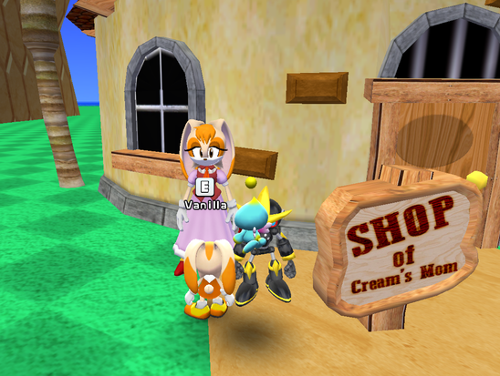
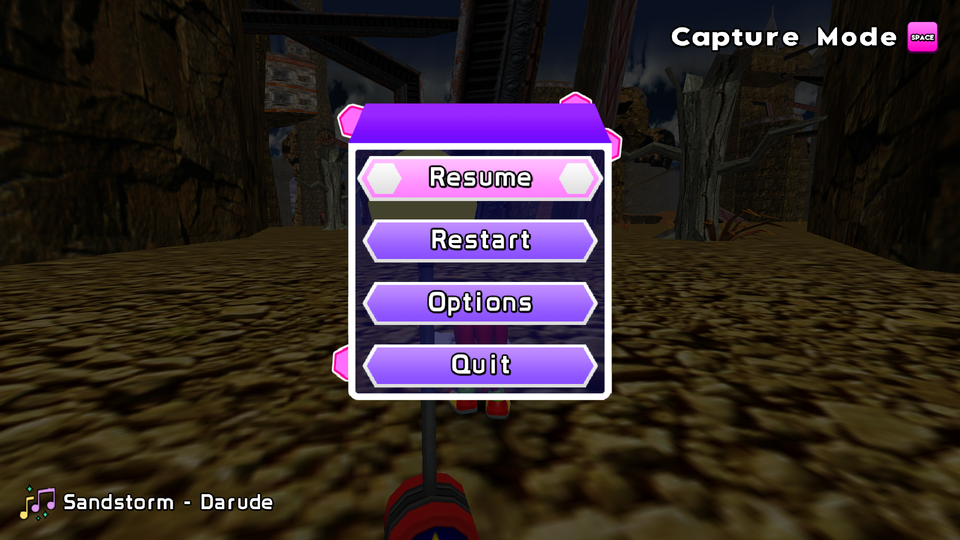

# Custom Music

Sonic World DX V1.2 introduced the Jukebox feature, allowing you to unlock tracks by finding them in stages, or by getting all emblems of an act.

Independent from the Jukebox is music equips. There is `Cyber DJ`, which shuffles between all Cyberspace tracks, and `Custom Music`, which randomly plays user-provided music.

This will tell you how to play your own music in the game. There aren't really music "mods", as they're just `.ogg` files, a common music format.

## Requirements

- **Latest** version of Sonic World DX (V1.2.7)
  - Any 1.2.X version should load the music fine, but it's good practice to stay up-to-date
- 2000 rings
- Navigation and Observation skills.

## Instructions

### 1. Getting your music

Music files are fairly easy to get, and is not the focus of this tutorial. This tutorial will assume you have the files already and want them working in-game.

- Check the file format of your music.
    - If it ends with `.ogg`, you should be good to move on.
    - If it ends with `.mp3` or anything else, it will need to be [converted to OGG](https://www.zamzar.com/converters/audio/).
    - If it has no ending, ensure your operating system has [file extensions visible](https://www.howtogeek.com/205086/beginner-how-to-make-windows-show-file-extensions/).

- Make sure your file's name is clean. The game will use the filename for showing the song name in the pause menu, **NOT** the title metadata.

- Move the music files into the `Custom Music` folder in Sonic World DX's `Mods` directory.

### 2. Unlocking Custom Music

Custom music is locked behind an equip so you can toggle it on and off on the stage select screen.

- Make sure the jukebox is **off**, as it takes priority over Custom Music. You can check if it is on or not by entering the Jukebox on the stage select.

- The equip costs **2,500 :material-circle-outline:**. If you don't have enough, you can gain rings from stages, unlocking costumes, endless marathon, or winning Chao Races.
    - Assuming you just started the game, the best way to get rings quick is to try unlocking as many costumes as you can, while finding Lightning shields in stages.
    - You should be able to get enough in about 10-15 minutes of gameplay.
- Once you have enough rings, you will have to go into The Island, where the shop is present.
- There are two shops on the island, the nearest being the first thing you see when you spawn.

- Walk up to the shop, you should see a prompt when near Vanilla. Press that button to open the shop.

- The Custom Music is in the Extras category.

- Purchase the equip. Once purchased, it should appear with faded green text. You can enable it by toggling it the same way you bought it.

=== "Off"
    
=== "On"
    

- Don't worry, you don't need to do this every time. You only need to go to the island to buy equips. You can enable and disable them by pressing the "Equip Menu" button in the stage select screen.

### Conclusion

That's it! The next time you load a stage, you should hear the song! It should also have its filename in the pause menu.

