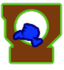
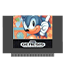
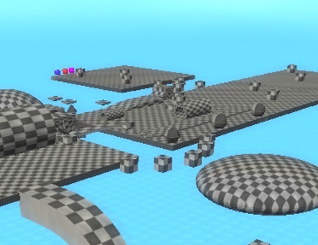

# Media

The media folder of a stage is a folder that houses all the misc. data for the stage, including the act metadata, thumbnails, loading screen images and music.

## Missions

```xml title="Missions.xml" linenums="1"
--8<-- "Missions.xml"
```

This file contains most metadata for each act, such as the mission type, description, and score requirements. If any information is needed from the stage in other sources, like the menu, it is contained here.

for example:

- `mission1` is the metadata for Act 1
- `mission2` is the metadata for Act 2

etc.

If a stage has the mission data for the act defined, **AND** an act xml file, the game will read the act.
A stage has an Act 2 if the stage has:

- a `mission2` section in `Missions.xml`
- an `act2.xml` in the stage's root folder.

**Important!** The structure of stages changed from `missions` to `acts` in V1.2. While most names changed because of this, the `missions.xml` is _mostly_ unaffected.

### Mission type

```xml
<mission1 is="normal"/>
```

- Determines the objective of the mission. Until 1.2, was a number, now numbers and names are supported. The table shows supported names and their missions.

| No.  | Name               | Description                                      |                                    |
| ---- | ------------------ | ------------------------------------------------ | ---------------------------------- |
| `0`  | `normal        `   | **Get to the goal.**                             |       |
| `1`  | `enemy        `    | **Defeat X enemies.**                            |      |
| `2`  | `ring        `     | **Collect X Rings.**                             |       |
| `3`  | `hunt        `     | **Find 3 Emerald Shards.**                       |      |
| `4`  | `gold        `     | **Defeat all golden enemies.**                   |  |
| `5`  | `stealth        `  | **Reach the goal without being detected**        |    |
| `6`  | `balloon        `  | **Pop X balloons**                               |    |
| `7`  | `hub        `      | **No clear condition, intended for HUBs**        |   |
| `8`  | `rival        `    | **Defeat all rival players.**                    |      |
| `9`  | `carnival        ` | **Defeat waves of enemies.**                     |   |
| `10` | `boss        `     | **Defeat the boss enemy.**                       |       |
| `11` | `flicky        `   | **Rescue 5 Flickies and take them to the goal.** |     |
| `12` | `lap        `      | **Run X laps around the stage.**                 |        |
| `13` | `escape        `   | **Reach the goal being chased.**                 |     |
| `14` | `encore        `   | **Reach the ruby** *(Reskin of normal run)*      |       |
| `15` | `collect        `  | **Collect X collectibles.**                      |        |

For ones with X, the act's `mission value` lets you set the number. In a boss mission, the value influences starting HP.

#### Mission type distinctions

Some mission types are similar but have differences. This sub-section will help you distinguish which one you'd need.

##### Carnival and Enemy

- Carnivals are waves of enemies, each wave progresses after all enemies of the prior are beaten.
  - Example stage: Green Forest Act 3
- Enemy Destroyers have a set number of enemies to beat, with no waves.
  - Example stage: Green Forest Act 2

Carnivals are ideal for if you want to make zombie-esque stages or linear stages, where you follow where the enemies spawn.

Enemy missions are better for faster, general destruction missions.

##### Hunt and Collect

- Treasure Hunt is like Sonic Adventure 2, with exactly 3 shards spawning in one of many set positions each reset.
  - Example Stage: Sky Rail Act 2
- Collectathon lets you collect any number of the Collectible object with a creator-defined requirement. These spawn in the same position each time.
  - Example Stage: Chemical Plant Act 3.

If you prefer SA2-styled stages with randomization each time you play, go for Treasure Hunt.
If you prefer placing collectibles in a fixed position for platforming challenges or fetch-quests, go for Collectathon.

Additionally for collectathon, you should object mod the Collectible object to be something distinct. adding a 64x70 `missioniconactX.png` to the Media folder will change the default key icon to a custom icon. If you object mod the Collectible, change the icon too so the player knows what to search for.

For example, Green Hill's collectathon makes you search for Sonic 1 cartridges, so the model and icon are changed to fit.



#### Mission Modifiers

- `time` Determines if the mission type will have a time limit attached to it.
- `mach` Sets if the stage will constantly be in mach speed state.
- `perfect` Sets if the stage will be a perfect run stage, where you must complete it in one life.
- `hard` Sets if the stage will be hardmode, removing elemental shields and making the player lose all rings on hit.

### Metadata

- `author` sets the creator of the stage seen in the loading screen
- `tag` is the sub-name of the stage
  - e.g. Luminous forest
- `info` is a description of the current mission
  - e.g. Get to the heat of Eggman’s Facility
- `origin` sets what stage the game comes from as displayed in the level select. This is an integer number in the order of the icon in “origins.png” located in the base game’s interface folder.
  

  - The number reads the image from left to right, top to bottom. I.e 4 is Sonic 2, 25 is Sonic Frontiers.
  - if a `originmX.png` is present in the Media folder, with X being the mission number, it will use the custom origin instead.
  - This must be a transparent 128x128 png.

- `music1`, `music2` `music3` Sets the name of what music tracks are in the act in the pause menu.
  - **Obsolete. Use the Music folder for this.**

### Scoring Data

- `idealtime` Sets what time you need to finish the stage under in order to earn the maximum time bonus, or if a time-ranked mission, an S rank.
  - Getting shorter than idealtime gets you an S Rank or 50,000 points
  - Every 10 seconds after this, your rank will decrease.
  - Every 20 seconds after the idealtime, your score bonus will decrease by 5,000 points.
- `maxtime` Sets the maximum allowed time on mission types that have a time limit. The stage automatically ends if this time expires
- `timetrial` Sets the time requirement for the time emblem. Does not affect scoring.
- `idealscore` Sets how much score must be earned at the end of a stage to get an S rank. Takes all other bonuses into account.

  - Getting 100% or over will give you an S rank
  - Getting 90% or over will give you an A rank
  - Getting 80% or over will give you a B rank
  - Getting 70% or over will give you a C rank
  - Getting 60% or over will give you a D rank
  - Getting a 50% or over will give you an E rank
  - Getting less than 50% will give you an F rank

  - This only applies to non-time ranked missions (Normal Run and Encore)

## Music

Stage music used to be in the Media folder under the label `hero.ogg`, or `heroMX.ogg` for act-specific music.

With the stage-restructure, acts now can load music in a more organised way, which is recommended for any new stage mods.

Music files, like all audio in the game, are in `.ogg` format. While the game has `.mp3` support, it is buggy on some machines so we highly recommend you stick with `.ogg`.

1. Put the Stage's music file in `Media/Music/Act1`, a new set of folders in the media folder.
   - Relative to your stage folder, it will be `My Cool Stage/Media/Music/Act1/Awesome Game Song.ogg`
2. If your stage has music triggers, the tracks for that trigger would be in `Act1-X`, with X being the music trigger number.
3. If your alternate act has different music, add a folder for it, like `Act2`

The benefits of this new system is that you can see the song name in the pause menu. It also futureproofs music in case Music Disc support for mods come to future versions.

## Images

### Thumbnail.png



This is a 4:3 preview of the stage act, visible on the stage select or a warp ring for the stage. This is a non-transparent 400x308 image.

- Adding `actX`, i.e, `ThumbnailAct2.png`, will make an act-specific thumbnail. This is recommended so users can tell the difference between acts.
- If no thumbnail is found, it will render a fallback error thumbnail.

#### Best practices for thumbnails

- Show the actual stage. Do not use renders or unrelated images.
- Show a mid-to-wide view that captures the main area of the objective.
- Don't show many objects, keep that for the loading background.
- If acts look similar to each other, take another thumbnail from a different position instead of using the same one.

### Background.png


This is a 16:9 1920x1080 image shown as the loading screen background.

- Adding `actX`, i.e, `backgroundAct2.png`, will make an act-specific background. This is recommended so users can tell the difference between acts.
- If no background is found, it will render a solid black background.

#### Best practices for backgrounds

- This will be slightly darkened in-game. Try not make it too clear as it may be hard to read loading text.
  - Most vanilla backgrounds add a subtle gaussian blur to accomplish this.
- Don't bother with text. It will be hard to read.
- The player will be looking at this for 30 seconds on average when loading the act. Make it visually interesting.

## Unlock Acts

By default, acts are unlocked by clearing the prior. If you want all acts available from the start, adding an empty file named `unlock.acts` will tell the game to leave all the acts unlocked. It doesn't check the file, only its name.
