# Migrating

Many stages use the .x format, but with the changes made to SWDX 2.0, that file format is unsupported. This guide will help you migrate stages to the supported .b3d format.

## Software required

[:material-blender-software: Blender](https://www.blender.org/ "Version 4.5 or later"){ .md-button .md-button--primary }
[DirectX Blender Importer](https://github.com/oguna/Blender-XFileImporter "To import the X"){ .md-button .md-button--secondary }
[B3D Blender Exporter](https://github.com/Yackerw/Blender-B3D "To export as B3D"){ .md-button .md-button--secondary }

## Instructions

### 1.0 Install software

1. Install Blender 4.5 or later from the Blender website. The addons will not work right on older versions.
2. Download the addons from their GitHub. Remember where you downloaded them. **Do not extract them from their .zip files**

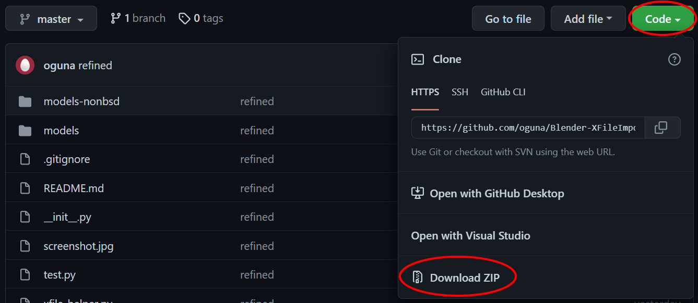
3. Open Blender, and find preference on the edit tab on the top-left.

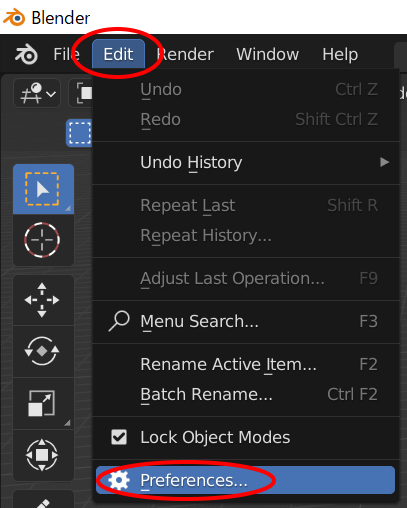

4. Click on the Addons tab in the sidebar. select the arrow on the top-right, and then click Install from Disk.

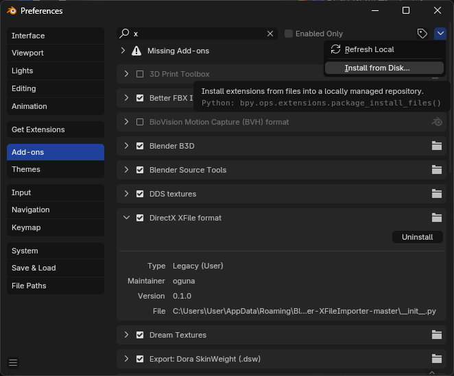

5. This will open a file picker. Select the .X addon's **zip** from the folder you remembered. This should add it to the addon list.
6. Search for the `DirectX` in the searchbar of the addons menu. If the checkbox is disabled, enable it. If no results appear, make sure youre on the right Blender version and try again.
7. Repeat steps 4-6 for the B3D addon, verifying by checking for `Blender B3D`.

Exit out of Preferences. Select File/Import. If a .x importer is listed, you installed the addon correctly!
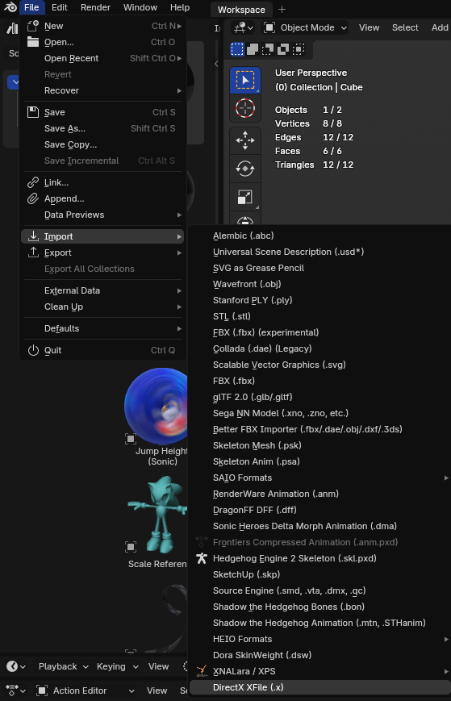

### 2.0 Converting the X file

#### 2.1 Importing the model

1. Go into File/Import/DirectX .x file
2. Find the .x file you want to import and select it. Do not import yet!
3. Edit the import settings on the right, to change the Forward axis from `Z` to `-Z`. Leave scale and up axis as-is.
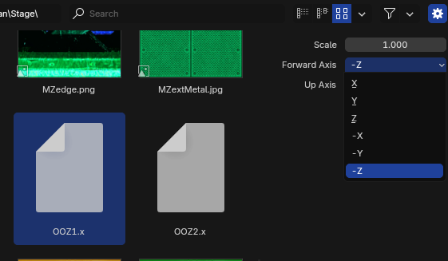
4. Import. It should load the model into Blender. If the model looks flat, you will need to press `Z` key to change the material type from `Solid` to `Material Preview`.
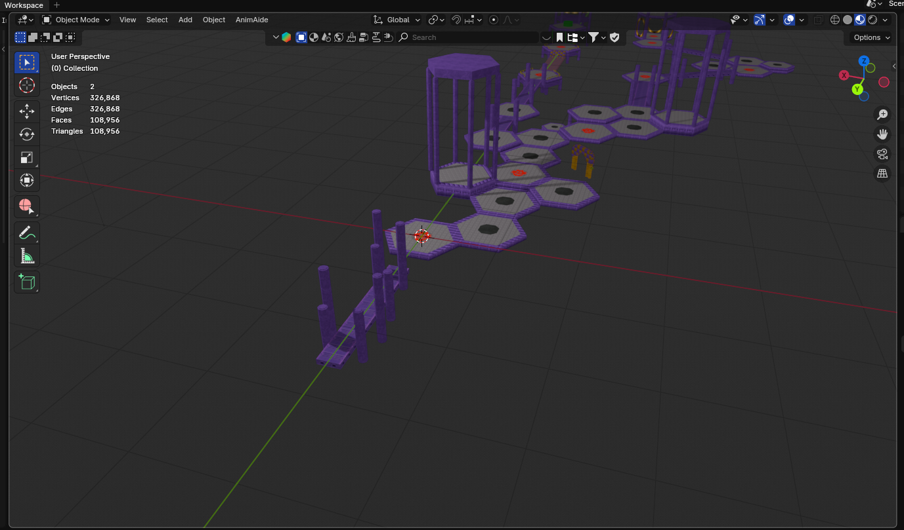

#### 2.2 Flipping the mesh

The import will be mirrored on the X-axis, you will need to flip it.

1. Select the model using left click on the viewport. Make sure you're in Object Mode.
2. Press the `S` key to enable scaling mode. Press the `X` key to lock it to the X axis and type `-1` to make it exactly the opposite x value. Press `Enter` after.

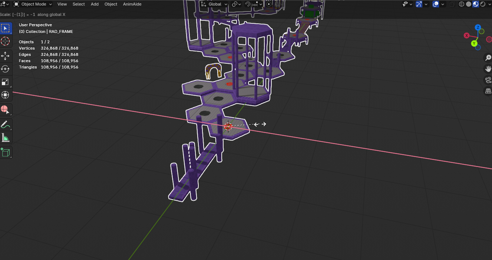

It's now flipped, but since it was negative values, it'll also be inside-out if you export it as-is.

3. Enter edit mode using `Tab`, or the object mode dropdown.
4. Press the `A` key to select all the model, then press `Alt` and `N` at the same time to open up the normals menu. Select Flip.
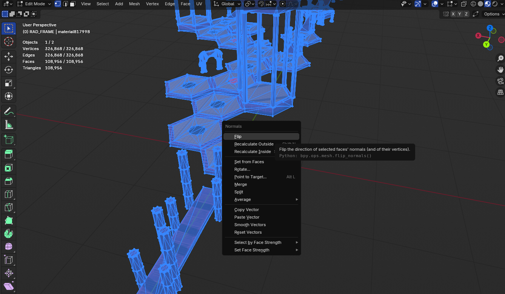
5. Return to object mode either by pressing `Tab` or the dropdown.
6. Apply the scale changes by pressing `Ctrl` and `A` at the same time and selecting All transforms.
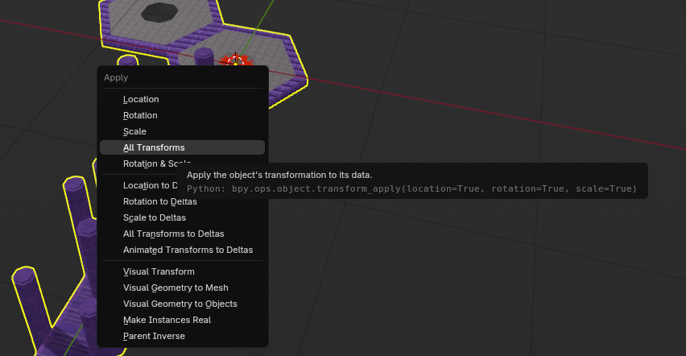

#### 2.3 Fixing the Vertices

the .X stages exported by Sketchup typically have all of their faces seperated from each other. This makes the poly count a lot higher than normal, and can cause the game to crash if exported as-is.

1. Select the model, and go into edit mode like before.
2. Select all using `A`. Press `P` to open the separation menu and choose `by Material`.
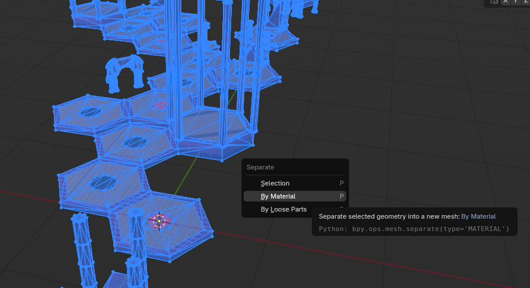
3. You should now see more models on your outliner on the left, one for each unique material. Exit out of edit mode into object mode.
4. In the outliner, click the first model on the list, hold the `shift` key, and click the last model on the list, to select all the models.
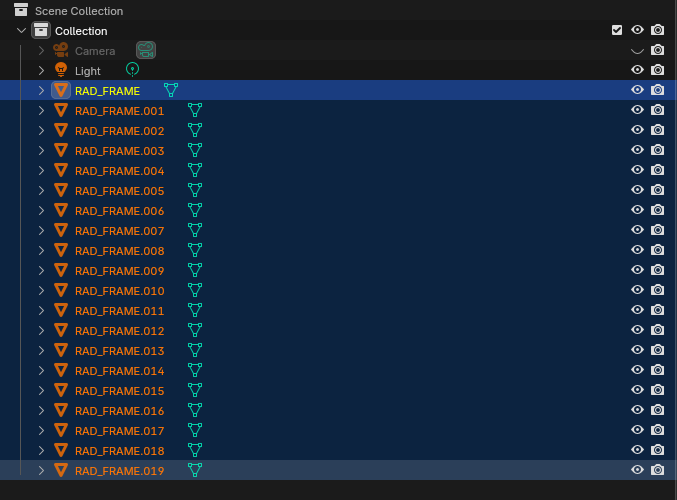
5. Go into Edit Mode. You should be able to edit all models, even though they're separated.
6. Press `A` to select all faces. Press the `M` key to open up the merge option, and select `By Distance`. This will merge any points touching each other, at least halving the vertex count.
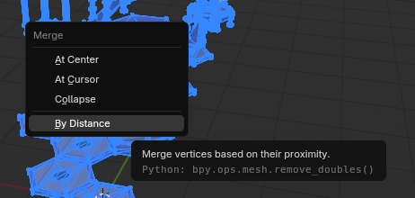
7. Go back to Object Mode.

If you have statistics visible, you can see the change

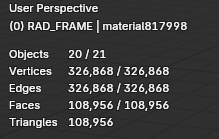
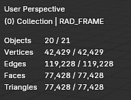

### 3.0 Exporting

Since

#### 3.1 Exporting to B3D
1. Select all of the models using the same step as 2.3's step 4.
2. Go to File/Export/B3D Model Export. If it doesn't appear, make sure you installed the addon correctly.
3. Save the model in the same folder as the original. You can name it the same for simplicity.
4. Edit the export settings on the right. Make sure both options are enabled.
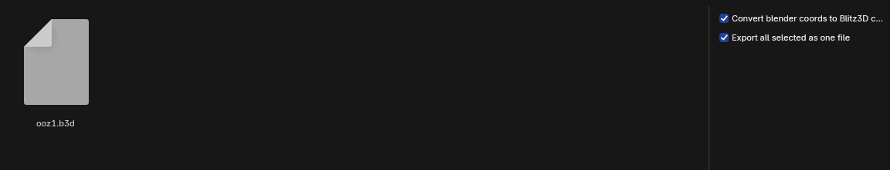
5. Click Export B3D. If all went right, it will create the B3D File

#### 3.2 Using the B3D in Sonic World

Now that the B3D file exists, it can be referenced. You'll need to edit the stage's parameters to do this.

1. Open the stage.xml or act.xml in the stage's folder using a text editor like Notepad or VSCode. VSCode is recommended as it colours xmls.
2. Find the name of the mesh you converted.
```xml
        <!-- Static meshes and meshes -->
		<mesh filename="Stage/OOZ1.x" visible="1" collision="1">
			<position x="0.0" y="0.0" z="0.0"/>
			<rotation pitch="0.0" yaw="0.0" roll="0.0"/>
			<scale x="200" y="200" z="200"/>
			<attributes>
				<color r="255" g="255" b="255"/>
			</attributes>
		</mesh>
```
3. Rename the mesh's filename to the folder and name you exported to.
```xml
        <!-- Static meshes and meshes -->
		<mesh filename="Stage/OOZ1.b3d" visible="1" collision="1">
```
4. Save the XML.
5. Load the game and check. There should be no visual change if you did all steps correctly!
