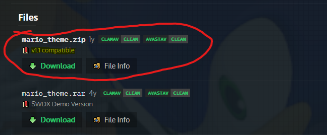
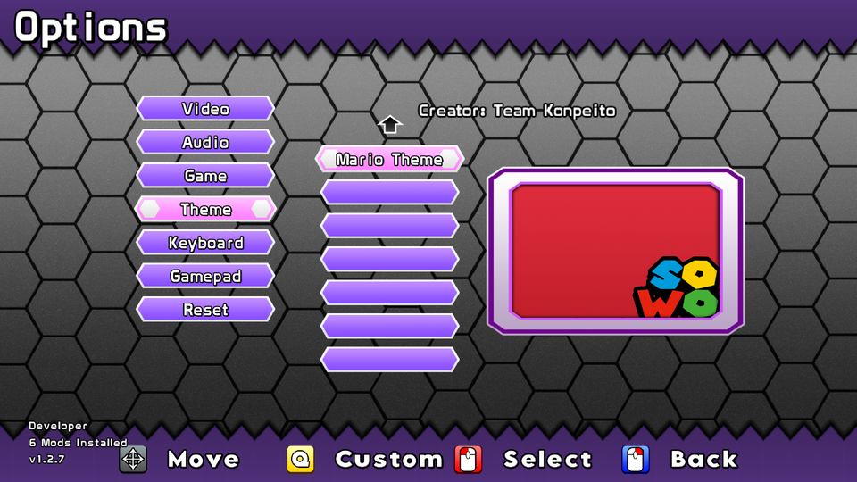
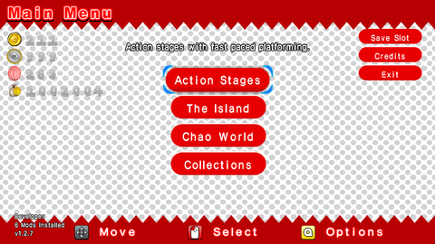

# Installing Theme Mods

## Where to get theme mods

The best source to get the latest mods is the [:simple-gamebanana: Sonic World DX Gamebanana](https://gamebanana.com/mods/cats/2301).
All the mods on the main website will **NOT** work unmodified as they're incompatible (designed for the SAGE Demo or earlier). Any Themes made after 2022 *should* work, or labelled for V1**.1** or later.
Otherwise, contact the modder to figure out what version the theme is developed for.

## Requirements

- **Latest** version of Sonic World DX (V1.2.7)
  - IMPORTANT! Earlier V1.2 versions have bugged theme loading and may fail to recognise the mod!
- A Theme mod of your choice.
- Extracting software ([WinRar](https://www.win-rar.com/download.html?&L=0) or [7zip](https://7-zip.org/download.html) recommended!)

For this tutorial, I will be installing The [Mario Theme](https://gamebanana.com/mods/34202). The instructions are the same for every team.

## Instructions

### 1. Download the Mod

Self-explanatory for some, complicated for others.

- click the page of the mod you wish to download.
- Scroll down to the files section, there is usually one.
- If there is more than one, download the one you want. Usually this is multiple versions. Get the most recent! (usually at the top)



- Save it anywhere, ideally away from the Mods folder for organisation reasons.

### 2. Extract the Mod
 
- Using the extracting software (I'll use WinRar), open the downloaded file.
- If all you see is a folder with the name of the mod, simply drag that folder and drop it into your Sonic World DX `Mods` folder.


- If the first thing you see when opening the archive is multiple folders and a settings.xml, Create a folder in the Sonic World DX `Mods` folder, then drag all of the contents into the created folder.

### 2.5 Mods.xml verification

**If you started your game in 1.2.7 this step is not needed. Move on to [Step 3](#3-activate-the-mod)**

If you created a save before 1.2.7, the theme might not load in game. In order to make themes load, you will need a line in the xml.

If you never edited your mods.xml, then all you need to do is:

- Delete the mods.xml
- Once you open the game, a new `mods.xml` should be present

If you edited the mods.xml to have custom locations, and don't want to lose it, then all you need to do is

- Add this line below the `sounds folder` line:

```xml
<themes folder=""/>
```

This means the game will check all folders in the Mods folder for a theme, and if it detects a `settings.xml`, it will load it as a theme.
You can add a folder between the quotes if you want your Themes to be stored in its own folder.

### 3. Activate the Mod

- Open the game.
- Go into the Options menu.
- Go into the Themes menu.
- Press Skill 2 (The key/button labelled "Custom") to switch to the Custom Themes tab.
- Your theme should be visible. Select it, then exit out of the options menu for changes to take effect.


Your modded theme is now installed and ready to use!

{ align=left } { align=right }
