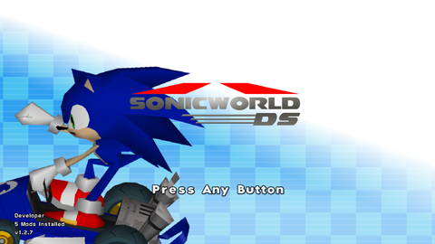
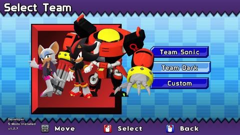

# Porting

Themes in Sonic World DX are comprehensive, allowing you to modify almost every sound and interface element in the game. In Sonic World R10 and earlier, themes are much simpler, only altering the buttons, backgrounds, logo and music.  

They will not work in Sonic World DX without changes, as the file format is different, so you will need to "port" it to DX. This page focuses on how exactly you can do that.

## Where to get theme mods

There are two places to get theme mods for Sonic World R10 or earlier:

1. The [:simple-gamebanana: Sonic World Gamebanana](https://gamebanana.com/mods/cats/2135) (This is DIFFERENT to the SWDX Gamebanana)
1. The R7-R9 Themes Section of the [Sonic World Website](https://sonicworldfangame.com/mods/themes/)

This tutorial assumes you're porting for personal usage. **Do not upload these mods without credit and permission to the original creator**.

For this tutorial, I will be porting the [Mario Kart DS Theme](https://gamebanana.com/mods/33769) by [Harukaze](https://gamebanana.com/members/1663337)

## Requirements

- **Latest** version of Sonic World DX (V1.2.7)
  - IMPORTANT! Earlier V1.2 versions have bugged theme loading and may fail to recognise the mod!
- A Theme mod of your choice.
- A code editor ([:material-microsoft-visual-studio-code: VSCode](https://code.visualstudio.com/) is recommended, Notepad also works but is harder.)

This tutorial assumes you know how to install mods already, and will ignore the downloading steps for that reason.

## Instructions

### 1. Get the original files

- Create a new folder in Mods with the name of the mod
- Drag the contents of the last folder (with all of the image and audio files) into that folder.

### 2. Organize the files

Sonic World DX splits the files based on category (Character/Sound/Interface).

- Create 2 folders, named `Interface` and `Sounds`.
- Move all the image files into `Interface`.
- Create another new folder in `Sounds` named `Music`.
- Rename all the audio files to remove the `Menu` prefix.
- For the file simply named `Menu`, rename it to `Main`.
- Drag all the audio files into `Music`.

It should appear something like this:

- Interface/
    - *Background.png*
    - *Buttons.png*
    - *Circle.png*
    - *Circle2.png*
    - *Logo.png*
    - *Logo_flash.png*
    - *Logo_ring.png*
    - *Logo_sonic.png*
    - *Logo_world.png*
    - *Sky.png*
- Sounds/
    - Menu/
        - *Credits.ogg*
        - *Intro.ogg*
        - *Main.ogg*
        - *Options.ogg*

### 3. Adding a settings.xml

Now that the structure is correct, we need the mod to be recognised by the game. We use a `settings.xml` to recognise it.

- Copy the `settings.xml` located in `Data/Themes` folder of Sonic World DX.
- Paste it into the root of your folder (where interface and sounds are).
- The contents will look something like this:

```xml title="settings.xml" linenums="1"  hl_lines="10"
--8<-- "settings.xml"
```

- You could test the theme in-game now and it would load, but it would look incorrect as the background will not load.
- To fix this, edit the highlighted line to the following values

```xml
<background x="1440" y="900"/>
```

This is the resolution of all R9 themes.

- For extra accuracy, you can make the logo animation behave like Release 7-8 by setting [logo style](themes.md#logo-style) to "1"
- Additionally, you can set the [author](themes.md#author) to the original author so you don't forget.

### 5. Testing in-game

Now time to test the theme!

- Select the theme in the custom themes menu.
- The theme should be working perfectly!

{ align=left } { align=right }

As so few files are modified, you may want to modify more files. You can see how to do this via Creation.