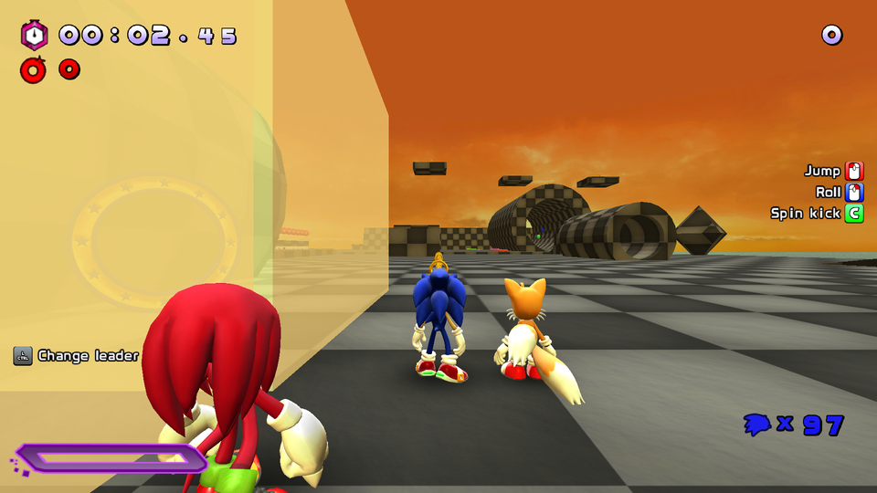
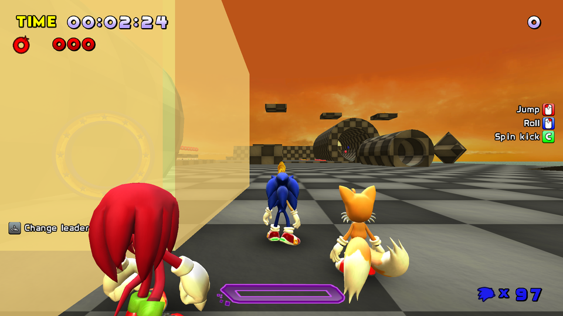
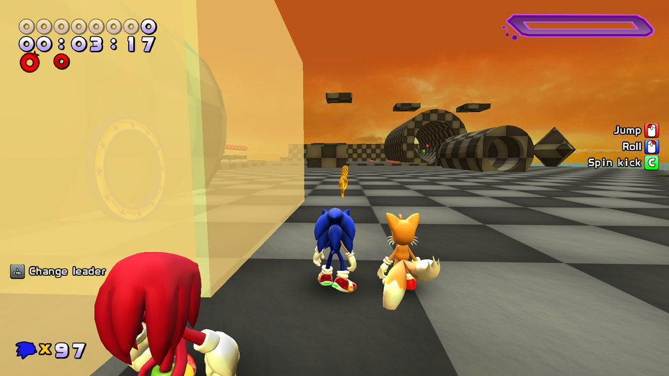
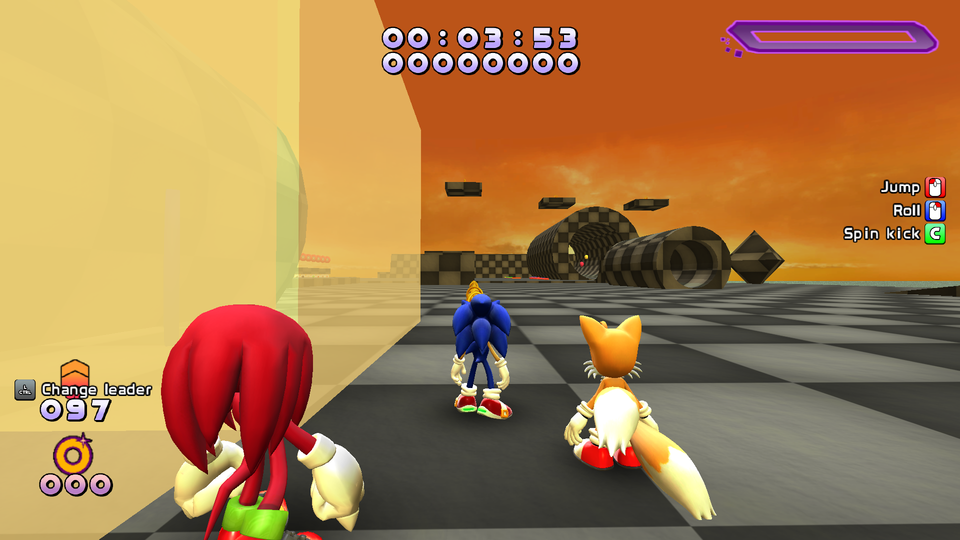
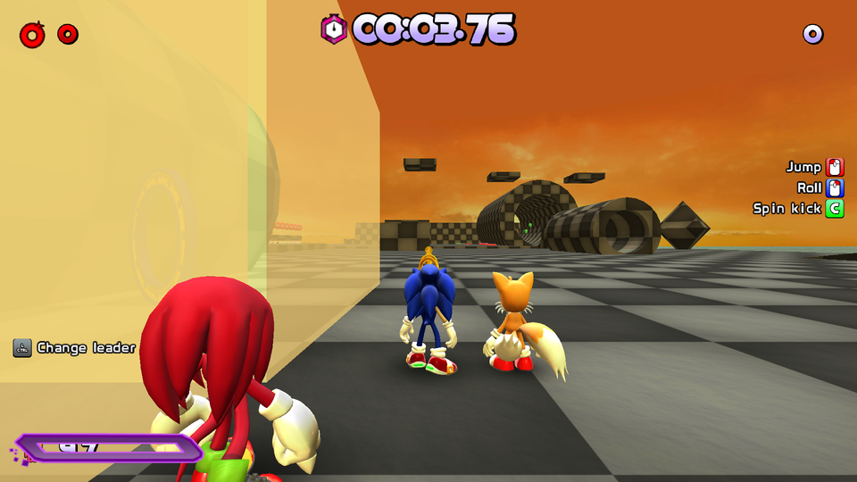
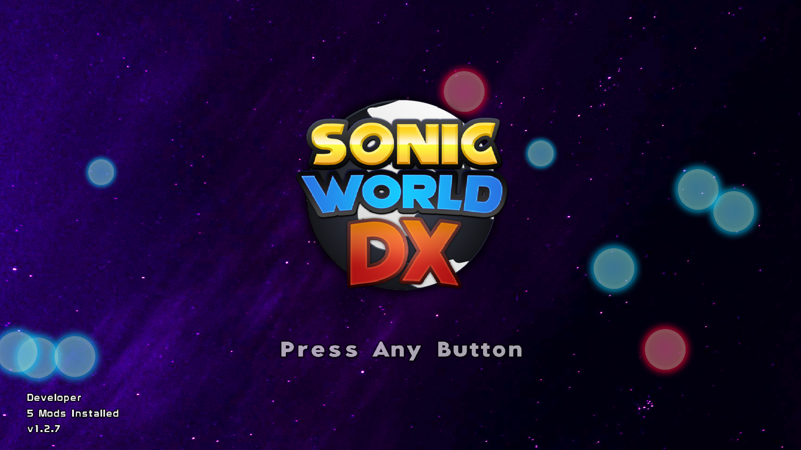

# Themes

## About Themes

Theme mods are mods that alter the interface elements _and_ sound files of the game, usually to resemble another game or to personalise your appearance.

## settings.xml

Each theme uses settings.xml to determine various functionality aspects of the theme, such as what HUD layout it should use, or what colour the special gauge is. A default settings.xml should look like this:

```xml title="settings.xml" linenums="1"
--8<-- "settings.xml"
```

A settings.xml is **REQUIRED** for a theme mod, as it is how the game recognises custom themes. In most cases you can just copy the DX Default settings.xml, and edit relevant values. DX's own settings.xml is stored in:
`Data/Themes/Settings.xml`

### HUD Style

```xml
<hud style=""/>
```

- Alters HUD placement in-game to closest match any of the following options:

=== "DX"
    
=== "Legacy"
    
=== "SA1"
    
=== "SA2"
    
=== "Heroes"
    
=== "Shadow"
    
=== "06"
    
=== "Generations"
    
=== "Forces"
    
=== "Frontiers"
    
=== "Classic"
    

### Heroes Spinner

```xml
<heroes spinner=""/>
```

- Set to 1 to enable separate spinners for each team member when playing in teams.

### Round Transition

```xml
<round transition=""/>
```

- Set to 1 to enable the round transitional image from heroes

### Logo Style

```xml
<logo style=""/>
```

- Set to 1 to enable the R8 logo fly-in animation

```xml
<victory timer=""/>
```

- (CURRENTLY NOT FUNCTIONAL)

```xml
<author is=""/>
```

- Write down the creator of the theme here

### Bubbles



```xml
<bubbles on="1" amount="6" chance="2" speed="1"/>
```

- This enables Bubbles on the title screen, like the Adventure 2 Theme
  - `chance` is the frequency they will spawn.
  - `amount` is the maximum allowed to be on-screen.
  - `speed` is a multiplier on their movement speed.

### Scrolling Background

```xml
<scrolling on="" speed="" alpha=""/>
```

- See SA2 theme for details

### Gauge Colour

```xml
<gauge r="" g="" b="" fr="" fg="" fb=""/>
```

- Set the normal and full gauge colours

### Sound Settings

```xml
<sounds life-pause="" loop-spin=""/>
```

- Pauses music on life gain or loop the spin sound

### Background Resolution

```xml
<background x="" y=""/>
```

- Sets the background resolution.
- Defaults at _1920 x 1080_
- If porting a Pre-2022 theme, set this to _1440 x 900_

Feel free to look at any base game theme’s settings xml and folder structure to figure out how they function. Remember in-game you can type `themedata` into the console to reload the theme’s settings without having to exit the game.

## kerning.xml

```xml title="kerning.xml" linenums="1"
--8<-- "kerning.xml"
```

Most themes leave this file out, which uses the defaults shown above. If your custom text letters overlaps each other, you may need to alter these values. Most of the lines are kerning for all png files that begin with `text`, except for one:

```xml
<number k="20"/>
```

- This determines the kerning of the numbers on HUD elements. If making the numbers smaller than the base game, lower this value.

[:simple-gamebanana:](https://gamebanana.com/mods/cats/2301) [:simple-discord:](https://dc.railgun.works/sonicworlddx)
